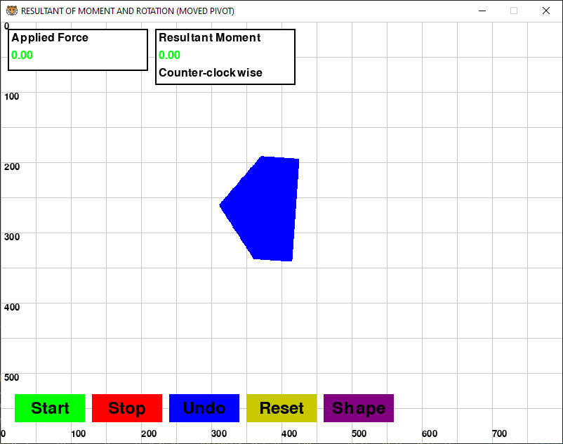

# Resultant of Moment and Rotation (Moved Pivot)

## Team Members (Contributors)
- [Chitiphat Thongchua](https://github.com/Chitiphat-T)
- [Sai Khun Min Thant](https://github.com/MR-SAIKHUN)
- [San Phyo Tun](https://github.com/Kami387)
- [Prince Yeoj Caravan](https://github.com/IamPrince2)

## Project Description
This project is a physics-based simulation built using Pygame, where a randomly sized and shaped object undergoes forces and moments. The user can interact with it to balance or stabilize its movement. All activities and warning will be logged.
## Requirements
- **Python Version:** 3.7 or higher
- **Dependencies:**
  - pygame 2.1.2 or higher
  - logging
  - math
  - random
  - sys

## Installation
To install and set up the project, follow these steps:
```sh
# Clone the repository
git clone https://github.com/MR-SAIKHUN/Mechanic-Project
cd Mechanic-Project

# Install dependencies
pip install -r requirements.txt
```

## Usage Guide
### How It Works
Step-by-step instructions on how to use the project, including logging and saving results.

```sh
# Run the project
python main.py

# How to use
A composite object is created at the center of the window with a random initial shape with random sizes
Forces are randomly applied to the object, and a pivot is randomly selected for the rotation.
```

### Functionality Overview
Users can control and interact with the simulation using buttons located at the bottom of the screen.

| Feature | Description |
|---------|-------------|
| Start | Starts the simulation and updates based on forces and moments applied |
| Stop | Stops the simulation |
| Undo | Reverts the object's position to to its initial state |
| Reset | Stops the simulation and and creates a new object |
| Shape | Changes the object's shape |

## Example Image
Here is a screenshot of what the simulation looks like.

